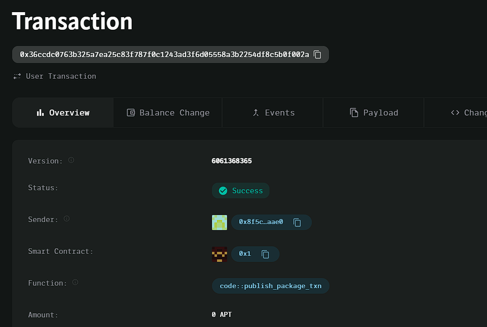

### Deployed smartcontract address: 0x36ccdc0763b325a7ea25c83f787f0c1243ad3f6d05558a3b2254df8c5b0f002a

### Screenshot: 

# Shared Economy Tool Rental Platform

## Project Title
Shared Economy Tool Rental

## Project Description
A decentralized marketplace where users can rent tools or equipment. Smart contracts manage rental agreements and payments, ensuring transparent and secure transactions between tool owners and renters.

## Vision
To enable peer-to-peer tool and equipment rentals by providing a decentralized platform where rental agreements and payments are securely handled via blockchain, fostering a shared economy.

## Key Features
- **Tool Listing for Rent:** Tool owners can list their tools for rent by setting a rental price and period.
- **Rental Payment Management:** Renters can pay for rentals directly through the platform, with payments securely transferred to the tool owner.
- **Smart Contract Automation:** Rental agreements are enforced automatically, ensuring transparency and preventing disputes.

## Future Scope
- Implement a reputation system for renters and tool owners.
- Add support for multiple cryptocurrencies.
- Introduce collateral or deposit management for high-value rentals.
